# GPU Microbenchmark Suite

Memory subsystem characterization and kernel isolation benchmarks for NVIDIA GPUs.

## Benchmarks

### memtest — Memory subsystem characterization

Pointer-chase latency and sequential bandwidth as a function of working set size, with explicit PTX cache hints (`ca`, `cg`, `cs`) and a forced-DRAM mode (`cn` = L2 flushed before measurement).

Also includes:
- **BLOCK_COST**: Per-block dispatch overhead — 128-thread blocks (4 warps × 32), `__launch_bounds__(128,1)`, reading L1-cached 4 KB buffer with data-dependent PTX loads. Varies blocks from 1×n_sms to 64×n_sms. Isolates SM block scheduling cost from cache/DRAM effects.
- **CONC_WARP**: Single-SM warp concurrency — pointer chase with 1–32 warps per block, L2 flushed, 64 MB buffer. Tests whether the warp scheduler overlaps DRAM latency across warps.
- **CONC_BLOCK**: GPU-wide block concurrency — pointer chase with 1 to 16×n_sms blocks. Tests block-level occupancy scaling.
- **L2_PERSIST**: Inter-kernel L2 persistence — flushes L2, then launches 10 sequential-read kernels back-to-back. Compares cold (launch 1) vs warm (launches 2–10) bandwidth to measure whether L2 retains data across kernel launches.

### arithmtest — Instruction-level throughput/latency

Inline PTX assembly microbenchmark for all arithmetic instruction types: FP32 (FADD, FMUL, FFMA), FP16x2 (HADD2, HMUL2, HFMA2), INT32 (IADD, IMAD), INT8 dot (DP4A), bitwise (SHL, SHR, AND, OR, XOR, LOP3, PRMT), and tensor core MMA (HMMA F16/BF16/TF32, IMMA S8). Two modes per op: throughput (8 independent chains) and latency (1 dependent chain). Architecture guards for sm_75 vs sm_80+.

### mmvq_bench — Isolated MMVQ kernel benchmark

Extracts the exact `mul_mat_vec_q` kernel and `vec_dot_q1_0_g128_q8_1` from llama.cpp. Runs on random data with no framework overhead. Configurable layer shapes (default: Qwen3-8B). Reports per-layer and aggregate TPS with effective bandwidth.

## Requirements

- NVIDIA GPU(s) with CUDA toolkit (nvcc, sm_75+ supported)
- Python 3.12+ managed by [uv](https://github.com/astral-sh/uv)
- OpenMP (for parallel chain building on host)

## Build

```bash
cd gpu-micro-bench
make          # builds both memtest and mmvq_bench
```

## Run benchmarks

```bash
# Memory subsystem (default)
uv run python run.py

# MMVQ kernel isolation
uv run python run.py bench=mmvq

# Smoke test
uv run python run.py --config-name=smoke

# Override from CLI
uv run python run.py gpu_ids=[0] overwrite=true
uv run python run.py bench=mmvq bench.n_reps=50
```

Configuration lives in `conf/config.yaml` (root) with bench-specific configs in `conf/bench/{memtest,mmvq,arithm}.yaml`. Dispatch via `_target_`.

## Generate plots and tables

```bash
uv run python plot.py

# Or for smoke results
uv run python plot.py --config-name=smoke
```

## Outputs

All outputs go to `results/{bench_name}/`:

```
results/{memtest,mmvq,arithm}/
  NVIDIA_CMP_90HX.json             # raw data per GPU
  NVIDIA_GeForce_RTX_2080_SUPER.json
  NVIDIA_GeForce_RTX_3090.json
  NVIDIA_Graphics_Device.json      # CMP 170HX (reports as "Graphics Device")
  results.md                       # markdown tables
  plots/                           # comparison plots (memtest, arithm)
```

## Key Results

### Arithmetic Instruction Throttling (arithmtest)

Inline PTX microbenchmark: 1 block, 128 threads (4 warps), 8 independent chains (throughput) or 1 dependent chain (latency). When tput ≈ lat, the functional unit is saturated/throttled.

#### Cross-GPU Comparison (throughput, ns/op)

| Op | CMP 170HX | CMP 90HX | 3090 | 2080S | 170HX throttle | 90HX throttle |
|----|-----------|----------|------|-------|----------------|---------------|
| FADD | 2.0 | 17.8 | 0.82 | 1.39 | **no** | **12.8×** |
| FMUL | 1.7 | 17.8 | 0.82 | 1.15 | **no** | **15.5×** |
| FFMA | **45.4** | 17.8 | 0.88 | 1.24 | **51.6×** | **14.3×** |
| DP4A | **45.4** | **35.6** | 1.34 | 1.24 | **33.9×** | **28.6×** |
| IMAD | 1.8 | 1.4 | 1.30 | 1.24 | no | no |
| IADD | 0.65 | 0.51 | — | 0.44 | no | no |
| HADD2 | 1.6 | 1.3 | — | 1.13 | no | no |
| HMUL2 | 1.0 | 1.3 | — | 1.13 | no | no |
| HFMA2 | 1.8 | 1.4 | — | 1.23 | no | no |
| SHL/SHR | 0.6 | 0.5 | — | 0.4 | no | no |
| AND/OR/XOR | 0.65 | 0.51 | — | 0.44 | no | no |
| LOP3 | 1.8 | 1.4 | — | 1.23 | no | no |
| PRMT | 1.8 | 1.4 | — | 1.26 | no | no |
| HMMA F16 | **181.6** | **284.5** | — | 16.6 | **severe** | **17.1×** |
| HMMA BF16 | **181.6** | **284.5** | — | — | **severe** | **severe** |
| HMMA TF32 | **90.8** | **142.2** | — | — | **severe** | **severe** |
| IMMA S8 | **90.8** | **71.1** | — | 2.23 | **severe** | **31.9×** |

Throttle ratios are vs 3090 (Ampere baseline) where available, otherwise vs 2080S.

#### Key Findings

1. **Two distinct CMP throttling profiles:**
   - **CMP 90HX (GA102 / sm_86):** ALL FP32 ops throttled 12-15×. DP4A throttled 28.6×.
   - **CMP 170HX (GA100 / sm_80):** FADD and FMUL are **unthrottled**. Only FFMA is throttled (51.6×). DP4A throttled 34×.
2. **FFMA and DP4A share a throttle clock on 170HX** — both land at exactly 45.4 ns/op, suggesting a single gated functional unit or clock domain.
3. **Tensor cores are massively throttled on both CMPs.** HMMA F16/BF16 ~182-284 ns/op, IMMA S8 ~71-91 ns/op. No useful ML compute through tensor cores.
4. **FP16x2 scalar is unthrottled on both CMPs** (~1.0-1.8 ns/op). This is the only viable path for FP16 compute on CMP cards.
5. **All integer ops unthrottled** — IADD, IMAD, bitwise, LOP3, PRMT all at normal speeds. Consistent with mining firmware preserving the integer pipeline.
6. **Implication for MMVQ:** The Q1_0 kernel uses 8× DP4A per loop iteration. With DP4A throttled 29-34×, a normally memory-bound kernel becomes compute-bound, explaining the 2× TPS gap vs consumer GPUs.

### Block Dispatch Overhead (BLOCK_COST, L1-cached)

| blocks/SM | CMP 170HX us | CMP 90HX us | 2080S us | 170HX us/blk | 90HX us/blk | 2080S us/blk |
|-----------|-------------|-------------|----------|-------------|-------------|-------------|
| 1         | 4.383       | 3.359       | 3.073    | 4.383       | 3.359       | 3.073       |
| 4         | 4.567       | 3.523       | 3.277    | 1.142       | 0.881       | 0.819       |
| 16        | 5.468       | 4.833       | 5.652    | 0.342       | 0.302       | 0.353       |
| 64        | 11.817      | 10.199      | 14.585   | 0.185       | 0.159       | 0.228       |

Both CMPs are faster than 2080S at high block counts. Ampere's block scheduler is more efficient than Turing's. Per-block dispatch overhead is NOT the bottleneck.

### Warp Concurrency (CONC_WARP, 1 SM, L2 flushed)

| n_warps | CMP 170HX ns/hop | CMP 90HX ns/hop | 2080S ns/hop |
|---------|-----------------|----------------|--------------|
| 1       | 391.4           | 268.8          | 236.5        |
| 4       | 411.8           | 268.9          | 238.3        |
| 16      | 436.1           | 269.8          | 244.3        |
| 32      | 457.9           | 270.8          | 251.5        |

Perfect linear throughput scaling on all GPUs. The warp scheduler correctly overlaps DRAM stalls. CMP 170HX has higher absolute latency (~390-460 ns) consistent with HBM2e vs GDDR6 characteristics.

### Inter-kernel L2 Persistence (L2_PERSIST)

| Size   | 170HX cold | 170HX warm | 90HX cold | 90HX warm | 2080S cold | 2080S warm |
|--------|-----------|-----------|----------|----------|------------|------------|
| 1 MB   | 107 GB/s  | 142 GB/s  | 88 GB/s  | 214 GB/s | 147 GB/s   | 288 GB/s   |
| 4 MB   | 238 GB/s  | 396 GB/s  | 281 GB/s | 372 GB/s | 292 GB/s   | 582 GB/s   |
| 16 MB  | 413 GB/s  | 712 GB/s  | — | — | — | — |
| 128 MB | 498 GB/s  | 504 GB/s  | — | — | — | — |

L2 persists across kernel launches on all GPUs. CMP 170HX has 32 MB L2 — warm BW stays elevated up to 16 MB (712 GB/s, well above its ~500 GB/s DRAM peak).

### MMVQ Kernel Isolation (Qwen3-8B, Q1_0_g128)

| GPU            | MMVQ-only TPS | llama-bench TPS | MMVQ time/tok | Eff BW (large layers) |
|----------------|--------------|-----------------|---------------|-----------------------|
| CMP 170HX      | 92.8         | —               | 10.77 ms      | 77-89 GB/s            |
| CMP 90HX       | 75.4         | 55.8            | 13.25 ms      | 65-71 GB/s            |
| RTX 2080 Super | 143.4        | 115.2           | 6.97 ms       | 255-330 GB/s          |

CMP 170HX is faster than 90HX (more SMs, higher memory BW) but still ~1.5× slower than 2080S despite having higher raw DRAM bandwidth — confirming compute-bound bottleneck from DP4A throttling.

## Cache hints

| Hint | PTX instruction | Caches used |
|------|----------------|-------------|
| `ca` | `ld.global.ca` | L1 + L2 (default) |
| `cg` | `ld.global.cg` | L2 only (bypass L1) |
| `cs` | `ld.global.cs` | streaming (bypass L1, evict-first in L2) |
| `cn` | `ld.global.ca` + flush | L2 flushed before measurement (guaranteed DRAM) |

## Cross-GPU Plots

### Latency (1 thread)
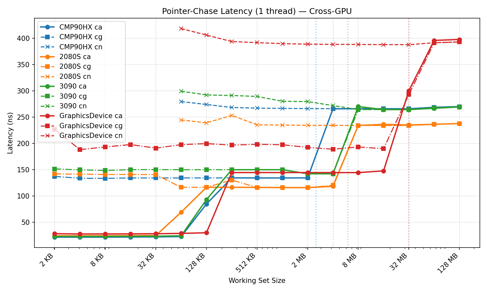

### Latency (all SMs)
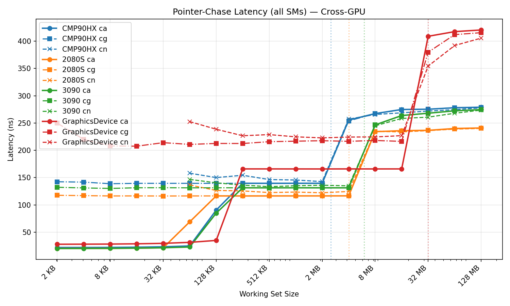

### Bandwidth
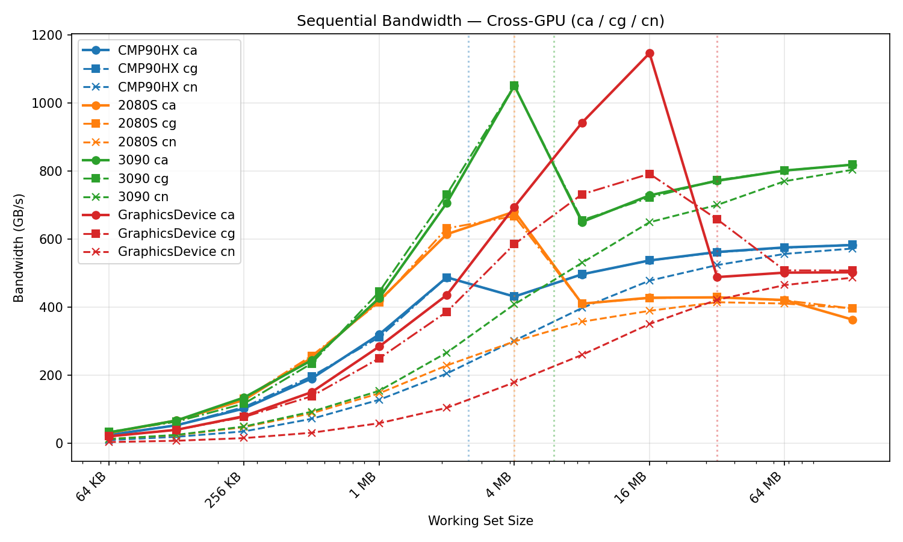

### DRAM Latency by Cache Hint
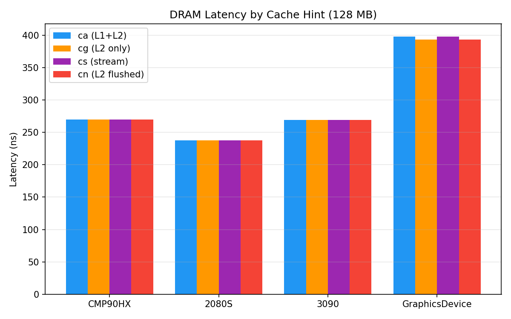

### Per-GPU Details

<details><summary>CMP 90HX</summary>

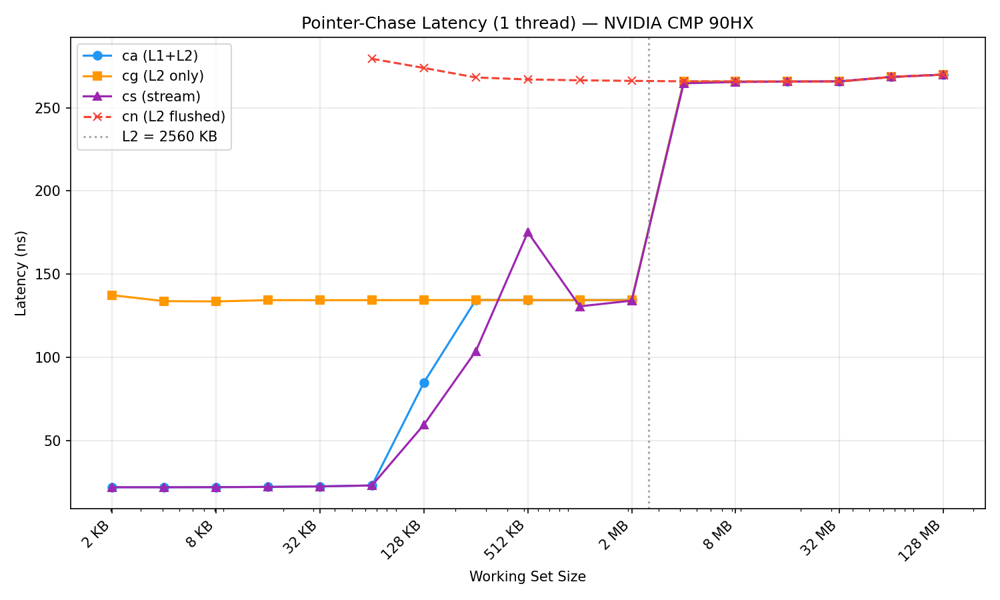
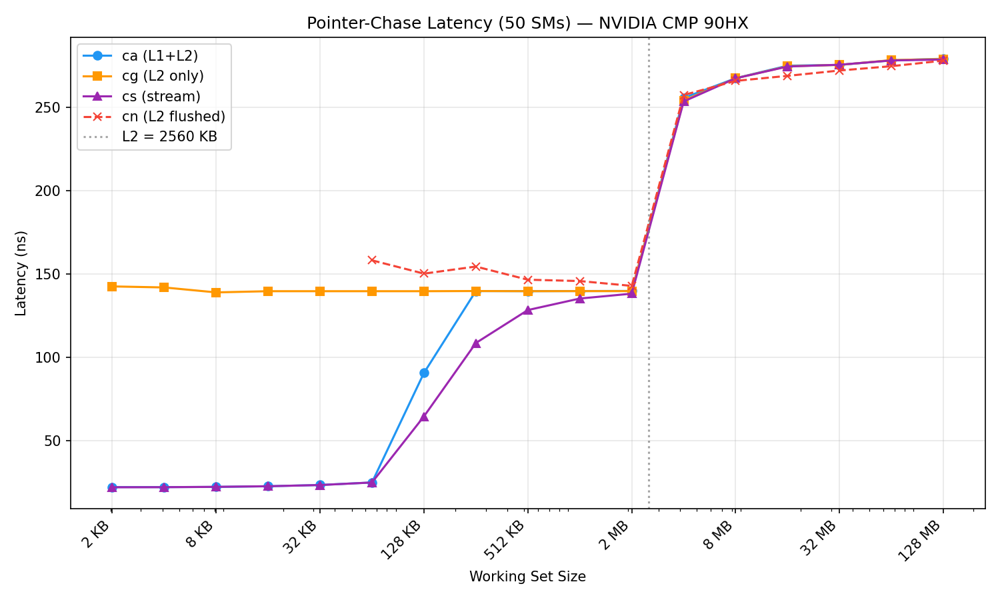
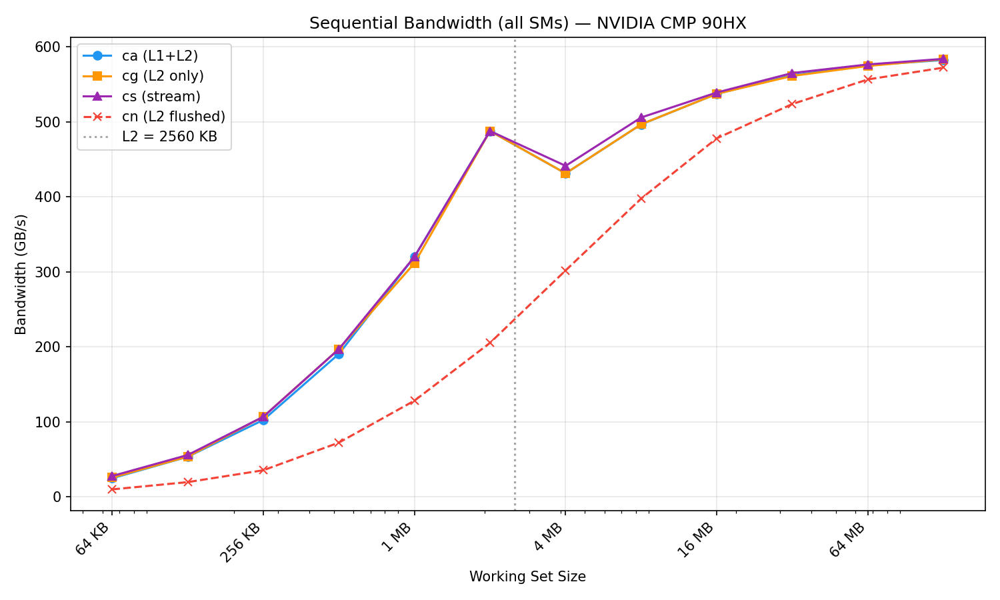
</details>

<details><summary>RTX 2080 SUPER</summary>

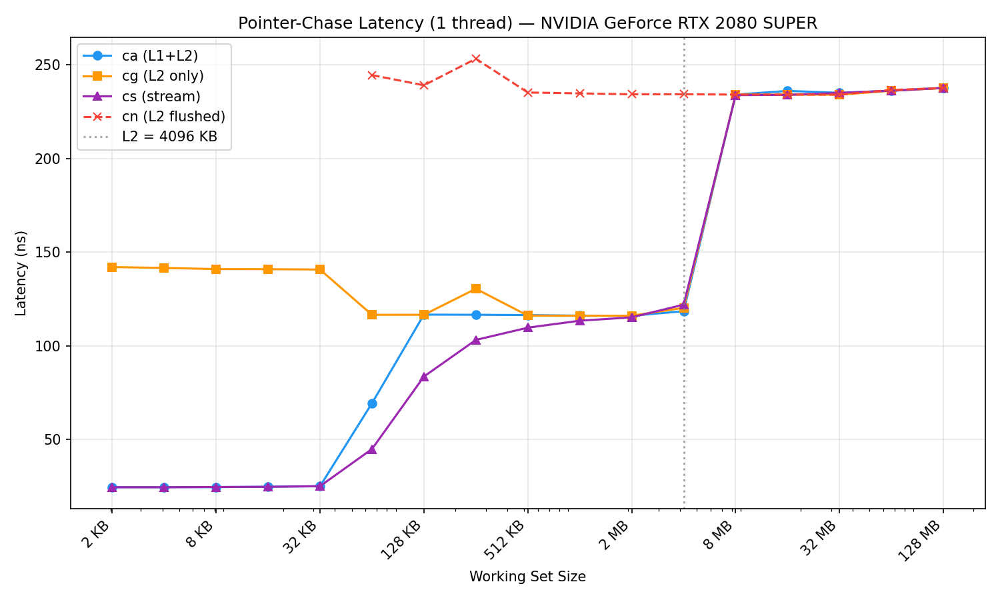
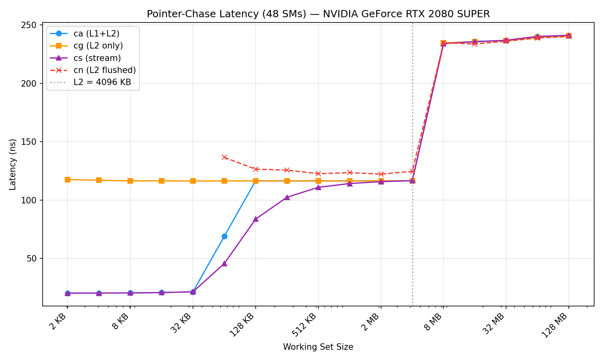
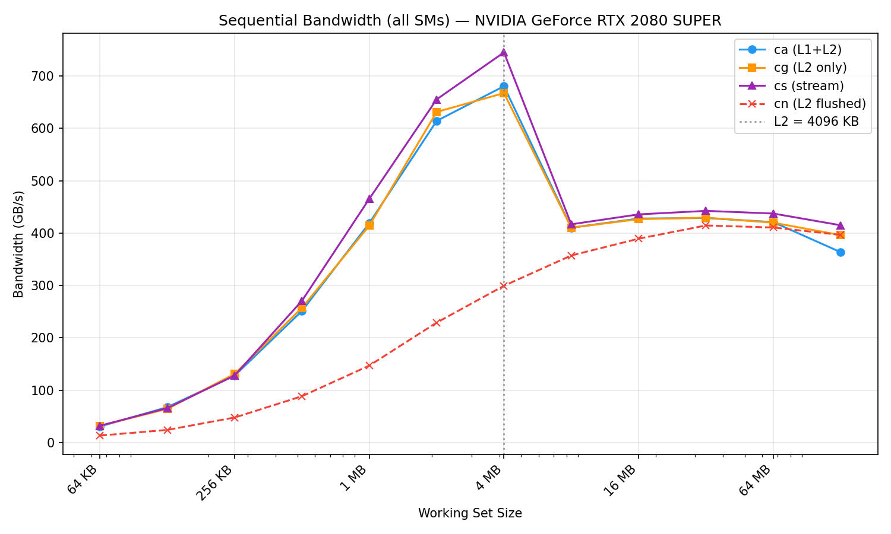
</details>

<details><summary>RTX 3090</summary>

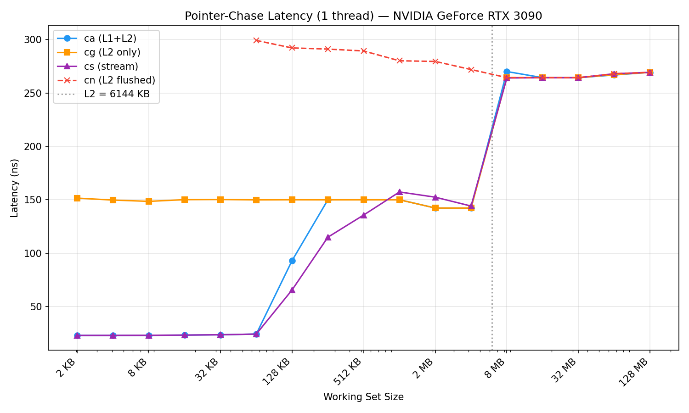
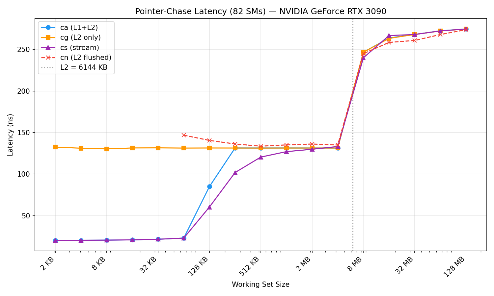
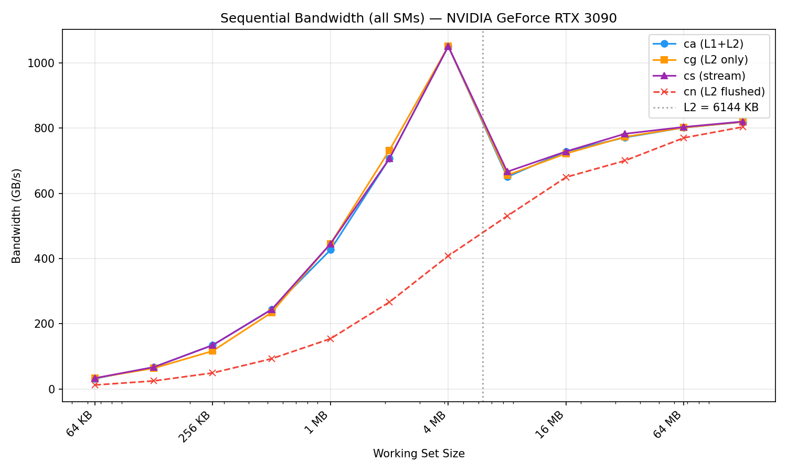
</details>

Full numeric tables: [results/memtest/results.md](results/memtest/results.md)
